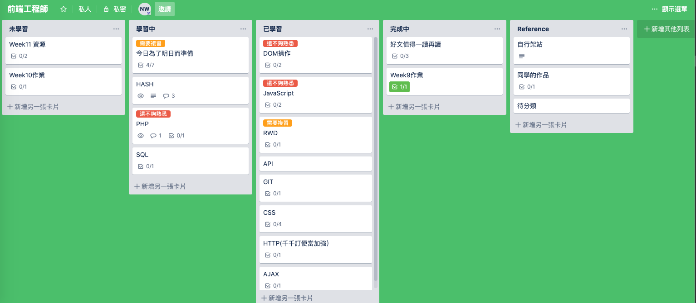

## 第六週: 基礎前端版面切版

###  課程體驗:
這一週,我印象是跟課很慢,因為我是那種示範code,然後會自己跟著演示一遍的人,只要我覺得是有用的就會截圖到自己的hack.md中.勾起我興趣的是,SEO的相關概念,這方面完全沒有接觸,第一次聽到覺得很新奇.

### 總結
雖然之前已經上過別的線上課程,也有些許概念了,但看到別的同學刻出來的版面,每次都讓我覺得很驚艷.
要加強的部分,就是要多看別人的畫面,並從中模仿了吧,因為後續有些功課要自己想畫面想UI
真的腦筋一片空白,顏色用的也醜,版面好像也沒有什麼新意,就置中完就沒有下一步了,這真的要多看同學的作業才能有想法有概念.

另外RWD每次都會忘記,可能太不常用到了,每次要用到就要複習一遍,經過複習週修改WEEK8 HW3才喚回一點記憶.這一週算是這次6~10週壓力比較不會那麼大的一週,比起寫程式,HTML/CSS 比較像是在調整參數的感覺.

## 第七週: DOM 操作

### 課程體驗:
這我也有些許基礎,基礎的語法例如:`querySelector`, `addEventListenr`這些都不難,但是要排列組合並信手捻來的和JS運用起來,真的需要點時間,我想這也是JS的核心吧,整個邏輯需要再加強

另外事件代理的部分,其中的例子形容得很生動,現在去麥當勞看到有人在幫別人點餐,我腦中不小心冒出事件代理. 
以前在學的時候完全忘記有學過捕獲和冒泡這一段,看了自己的筆記才得到佐證,到現在『先捕獲在冒泡』整個根深柢固在我腦裡,我覺得那個流程圖幫助我很多,可能以前比較像是用背的吧. 

### 作業部分:
這一週是我沒有準時當週交作業的一週,印象相當深刻,也是讓我挫折感最大的一週

第一題:  
一開始規劃沒有多想,其實就依照他的時序,想到哪就做到哪一直加上東西上去,但是一直做不到這一點『若是失敗，畫面就不會再變色了，除非你點選再玩一次』,這個部分我真的做不出來,我點了再玩一次但是畫面會馬上變色,這很顯然不及格. 

我還找了前端的朋友,問他我邏輯上是否有問題,或是有什麼新的想法,但是他也掛掉,只好看胡立的答案.
這個功課也讓我學習到了`settimeout`, `cleartimeout` , `setInterval` 的差別和用法.
也讓我知道自己對於邏輯方面還不是很能掌握得住.

第三題:  
計算機那題更是崩潰, 刻板ok, 讓數字顯示到計算機上也ok, 但是一點到加減乘除符號,我就掛掉,完全不知道要怎麼下筆. 
看了答案,也很喪氣,因為這個做法是這個階段的我所想不到的,常常想著你說過的話,要下一次能夠做的出來,才是真的會,看來我還有好長的一段路要走

### 總結
這一週打擊很深,也讓我重新思考寫題目的方式,例如寫題目前會先用筆記本紀錄流程和語法,我看到許多人也和我一樣,覺得不孤單了,也看了你說的

> 看到有些人怎麼過得那麼順遂，好像作業都輕鬆解決，然後進度領先到不知道哪裡去了。可能他以前學過，或也有可能他真的跟你一樣無基礎但就是對程式這塊特別厲害，天生就程式腦。人生就是這樣嘛，大家的起跑點本來就不一樣，每個人都是獨一無二的。`

這個被我放到每日心得的一句話,時常激勵著我
> 寫程式本來就是跌跌撞撞的，先完成一部分，再完成一部分，最後再把它組裝起來,而且也不是寫完就寫完了，也有可能邊寫邊改之前的地方，這些都是再正常不過的事

總之, 這一週就是加油再加油！

## 第八週: AJAX

### 課程體驗:
這一週就好很多了,不僅學習的部分少,功課難度也降了很多,對於AJAX的概念還ok,前一陣子也有在其他線上課程學過,但是當時不知其所以然,就跟著source code的模板打出來. 其實AJAX要了解,是要補足第四週的網路基礎概論,不然直接AJAX會無法掌握前因後果,也搞不清楚到底是要用`GET`還是`POST`,課程體驗我就一直回想起`千千訂便當`的範例,所以其實還蠻順利的. 

### 功課
除了第二題卡住摸不清頭緒外,第一題和第三題沒有花很久時間就寫完基本題了,所以都蠻簡陋的,參考同學的作品後,真的覺得有些人的方式很簡潔,一直使用function去包裝,但是我不會這樣寫.自己的code都是一坨一坨的. 讓code變的簡潔,這是我下一步要加強的部分我已經把這些值得研究的code印出來,並且透過筆記的方式補充.  

另外我想抒發, 慎選參考的對象,這件事也很重要  
跟自己實力差不多是可以參考,也是有值得學習的地方,但不用花太久時間.  
最好是那一種瞬間看不懂,要稍微細看下才看得懂的.  
如果是那一種細看也看不懂,就不用看了,果斷放棄.  

### 總結:
這一週做完功課後,有讓我喘口氣的感覺,對於串API越來越了解,尤其是第三題吧,看到client-ID,讓我想到我曾經被他折磨了一個上午,整個頁面做出來成就感滿滿. 

## 第九週: 初探後端領域

### 課程體驗
看了導讀, 發現有那麼多需要研讀和影片著實讓我嚇到了,因為我還有在工作,平常每天晚上七點半到12點半已經很緊繃了.
再加上我從來沒有後端的基礎,還要同時知道什麼是PHP 語法,server, database, 還要了解MySQL的語法, 並看物件導向的文章,老實說我不知道自己是不是能抽出那麼多時間. 

我問自己是要跟著自己的腳步走?還是以課程進度為優先,我的選擇是跟著自己的腳步走,比較扎實.

一開始也不知道學習的順序,但是剛好我在看Lesson 5-1時,不小心瞄到同學的每日進度有寫到觀看順序,果然這樣更能串的起來,這一週看影片的速度也很緩慢,但是每當這些影片有些code的內容是重複時,我都會先按暫停,問自己下一步是什麼?

### 功課
HW2沒花很多時間就做出來了,但是HW3就卡了

1. setCookie 不知道如何操作? 怎麼加,加在哪？
2. 在不同的table之間怎麼連動? 其實我有想到要用join, 但是我只有聽課和做筆記,實務上也沒有印象要怎麼做.

別無辦法,到處找資料,還上youtube看印度阿三打的code找教學,但是阿三的英文真的是出了名的難懂,只看的懂code,聽不懂英文,後來實在想不到了,所以只好看了『程式導師實驗計畫第二期：Week10-1 PHP 簡易會員系統 + 留言板』,才知道該怎麼做,並且最後實作出來

但是我最後交功課前真的經驗不足,整個忘記還有提供一組dbName, 一直沒有加到conn.php裡面, 另外在遠端的資料庫的table和localhost的table命名不一樣,也沒有修改到,弄了好久自己也想了好久才修改完成,所以又遲交了一兩天,本來想在slack上發問,還好沒有,因為怕剝奪其他同學debug的樂趣(?),我覺得這坑很值得踩一下！

### 結論
老實說,這一週不小心有讓我動了放棄的念頭,我也一度想說我要不要繳錢啊?
我真的適合工程師嗎? 但我突然想起你曾經說過的話,**要問自己學會了什麼?**

我記得那天突然冒出這個想法時,我一邊騎著車一邊想著:
1. 每一週學了什麼技術?
2. 為什麼要成為前端?

想著想著,突然很感謝自己,是自己給了自己這個想要嘗試的機會,又想到了每做完一項功課的成就感,突然信心爆棚,雖然作品可能不是很漂亮,但是已經讓我很自豪的想和大家宣佈這是我做的(菸)

這就是我想要從現在的工作拿不到的東西,『成就感』一直驅動著我,也是我過去工作都不會賦予到的. 

於是我咬著牙, 告訴自己這些都不難拉,只是心魔,睡一覺就會好的
我目前的工作是外勤,就是風吹日曬雨淋都要在外面走跳,但是做好該做的事後,就可以自由運用時間,並且不用加班.

我一般是去圖書館或是咖啡店先看過一遍BE101,再回家看過一次,在跟著一起打code. 
從php 是什麼都搞不清楚,到現在我覺得資料庫操作好像不是很難啊@@?

就這樣我把後端的功課做完了,也沒有想像中的久,印象中就是一個週末的事情.

## 最終結論和到下一週複習週的期勉

總的來說,這6~10 周相比前幾週難度提升很多,我也發現很多同學每日進度沒有以前勤,字數也少很多,但是厲害的還是很厲害拉,挑戰題我完全不會想挑戰,因為基本題都快要掛了....

雖然我平常有在上班,但是假日我都盡量把握時間,有多時間用多少時間. 

曾經聽過一句話:
> 當一件事在決定要不要做之前,要試著想自己如果是70歲時,會不會後悔自己做的這個決定或是不做這個決定. 

還好我現在也還是一人飽全家飽,經濟壓力沒有那麼大

這一個複習周也複習到了很多平常想說之後再補,之後再看的文章,也看了同學的code,複習RWD. 
並讓自已適時的放鬆, 不要給自己太大的壓力.

另外因為學習的東西越來越多,要讀的文章越來越多,導入了新的工具-Trello,每次都加入到我的最愛,網站一多自己都不想碰了,我想透過這樣的歸類會比較好

明天過後我就不是奔3了,是直接正式邁入3字頭, 在大學畢業時,也從來沒想過自己會往程式的路邁進, 希望我可以狹持著會程式語言的優勢,悠然的面對之後的人生. 

**下一週我來了！！！**